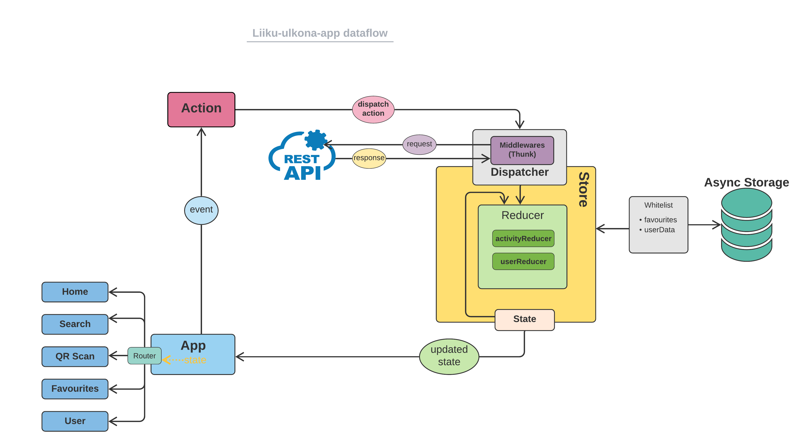

# Overview
Liiku Ulkona is an application to promote and help people exercise/train for free using already available free options in Helsiki and neighbouring cities. 

# App features
* View all the outdoor activities and options available in near surroundings.
* Search an activity based on the current location.
* Find all the details related to an activity.
* Save an activity in your favorite list.
* Claim points by visiting the exercising places.
* Use collected points to activate the benefits.

## Prototype 
 [Prototype](https://www.figma.com/proto/uGG7AtMk3iSF5QewQ5c16v/Helbbo-Liiku-ulkona?node-id=37%3A287&scaling=min-zoom&page-id=37%3A285&starting-point-node-id=37%3A287
)

## Built With

- [Expo](https://expo.dev/) - Framework and a platform for universal React applications
- [Redux](https://redux.js.org/introduction/getting-started) - For state management of the application with a centralized place called store
- [Redux Thunk](https://redux.js.org/usage/writing-logic-thunks#what-is-a-thunk) - A miidleware to call the action creators that return a function(thunk), used to despatch the synchronous action after the API call has been finished.
- [AsyncStorage](https://docs.expo.dev/versions/latest/sdk/async-storage/) - Async, unencrypted module that allows to persist data offline in React Native apps.

## App Flow 
<p align="center">
    <a href="http://">
        
    </a>
</p>


## Application Structure 

```

├── assets                          #assets, static files
├── src
│   ├── components                  #shared components used across features
│   ├── navigation                  #stack navigator
│   ├── screens                     #multiple screens
│   ├── services                    #logic external API
│   ├── store                       #redux store
│   │  ├── actions                  #all the calling action creators
│   │  ├── reducers                 #all the reducers used around redux
│   │  ├── types                    #static values
│   ├── theme.js                    #theme styles like colors, font styles

```

<!-- GETTING STARTED -->
## Getting started

### Clone
```sh
git clone git@github.com:utsabk/liiku-ulkona-app.git
cd liiku-ulkona-app
```
After that run this command on project path

```sh
$ expo install
$ npm install
$ expo start
```
Your app should be running now.

## Demo
- [App Features](https://youtu.be/A9jyRBwlYwM)
- [Presentation](https://youtu.be/5iza5jHNYeE)